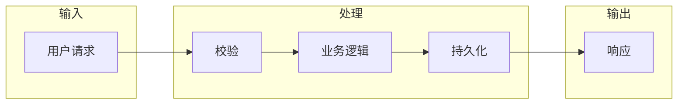

# Mermaid 图规范

## 常用图类型
- `flowchart LR/TD` — 数据流、架构
- `sequenceDiagram` — 接口交互
- `classDiagram` — 数据模型
- `gantt` — 时间线

## 规则
1. 节点文字用中文，简洁（不超过 8 字）
2. 方向优先 LR（左到右），层级多时用 TD
3. 子图用 `subgraph` 标注边界
4. 颜色/样式只在有区分需要时使用
5. 确保 Obsidian 预览可正常渲染

## 示例

