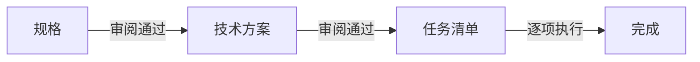

# 研发流程与阶段门禁

## 三阶段门禁

### 1. 规格（要什么）
- 明确功能描述、输入输出、约束、验收标准
- 产出：`规格.md`
- 门禁：用户确认 "规格通过" 才进入下一步

### 2. 技术方案（怎么做）
- 架构设计、数据流、关键实现、依赖与风险
- 产出：`技术方案.md`（based_on 指向规格版本）
- 门禁：用户确认 "方案通过" 才进入下一步

### 3. 任务清单（拆成什么步骤）
- 可执行的原子任务列表
- 产出：`任务清单.md`（based_on 指向方案版本）
- 逐项执行，完成即勾选

## 版本同步规则
- 每次进入模块前，先比对 based_on 与上游 version
- 不匹配 → 先同步文档再继续工作
- 同步时更新 version 和 based_on

## 小原子渐进
- 需求拆成最小可独立交付的模块
- 每模块独立走 规格→方案→任务 循环
- 范围小 = 上下文集中 = AI 不跑偏 + 人易审阅
