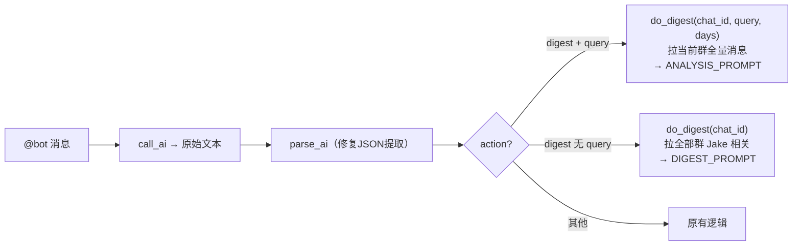

# 消息分析修复与增强 技术方案

## 整体架构

不改架构，只改 `bot.py` 中 4 个位置：`parse_ai`、`do_digest`、`send_daily_report`、prompt 常量。

## 数据流



## 关键实现

### 1. parse_ai 修复

```python
def parse_ai(raw):
    if not raw:
        return {"reply": "稍等哈～", "action": "none", "params": {}}
    try:
        return json.loads(raw)
    except json.JSONDecodeError:
        # AI 返回 "解释文字\n{...JSON...}" 时，提取 JSON 部分
        m = re.search(r'\{[^{}]*"reply"[^{}]*"action".*?\}', raw, re.DOTALL)
        if m:
            try:
                return json.loads(m.group())
            except json.JSONDecodeError:
                pass
        return {"reply": raw, "action": "none", "params": {}}
```

### 2. do_digest 改造

签名变更：`do_digest(chat_id)` → `do_digest(chat_id, query="", days=0)`

**有 query（定向分析）**：
- 只拉 chat_id 这个群
- 时间范围 = `now - days 天`（days 从 params 来，默认 7）
- 用 `--page-all` 拉全量，不限 50 条
- 不做 Jake 正则过滤，所有消息都收
- 用 ANALYSIS_PROMPT（新增），把 query + 消息列表交给 AI

**无 query（通用汇总）**：
- 拉所有群，2 天范围
- 用 `--page-all` 替代 `--page-size 50`
- 保留 Jake 正则过滤
- 用现有 DIGEST_PROMPT

### 3. 消息格式化

统一用 sender name 而非 sender id：
```python
sender_name = m.get("sender", {}).get("name", "未知")
content = m.get("content", "")
```

### 4. REPLY_PROMPT 修改

digest action 描述改为：
```
- digest: 消息汇总或定向分析 → params: query(用户原始问题，通用汇总时留空), days(时间范围天数，默认7，通用汇总时不需要)
```

### 5. 新增 ANALYSIS_PROMPT

```
你是飞书群消息分析助手。根据用户的问题，从群聊消息中提取相关信息并回答。

用户问题：__QUERY__

以下是群里最近的消息记录：
__MESSAGES__

要求：
- 只回答与用户问题相关的内容
- 引用具体的人和消息内容
- 简洁明了，纯文本
- 如果消息中没有相关内容，如实说明
```

### 6. send_daily_report 修复

- 时间范围：`datetime.now().replace(hour=0, minute=0, second=0)` → 当天 0 点（已有，不变）
- 字段修复：`body.content` → `content`，sender id → sender name
- 用 `--page-all` 替代 `--page-size 50`

### 7. execute_action 调用适配

```python
elif action == "digest":
    return do_digest(chat_id, params.get("query", ""), params.get("days", 0))
```

## 依赖与风险

- `--page-all` 在消息量很大的群里可能较慢，但 lark-cli 默认限 10 页（每页 50 条=500 条），可接受
- MiniMax 对 days 参数的推断可能不准，但默认 7 天兜底，影响不大

## 测试策略

在 worktree 中改完代码后：
1. 本地启动 bot，在群里 @bot 发测试消息
2. 验证 3 个场景：通用汇总、定向分析（按人）、定向分析（按内容类型）
3. 确认日报逻辑无报错
