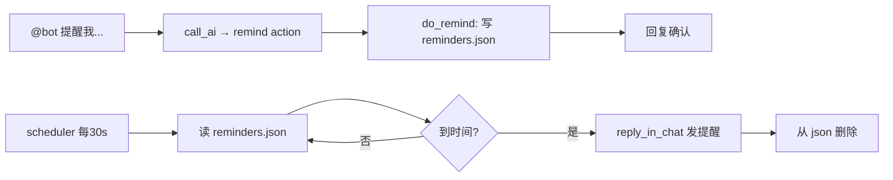

# 提醒功能 技术方案

## 数据流



## 关键实现

### 1. REPLY_PROMPT 修改

action 列表新增：
```
- remind: 设置提醒 → params: time(ISO8601+08:00), message(提醒内容)
```

### 2. do_remind 函数

```python
REMINDERS_FILE = os.path.join(os.path.dirname(__file__), "reminders.json")

def load_reminders():
    if os.path.exists(REMINDERS_FILE):
        with open(REMINDERS_FILE) as f:
            return json.load(f)
    return []

def save_reminders(reminders):
    with open(REMINDERS_FILE, "w") as f:
        json.dump(reminders, f, indent=2, ensure_ascii=False)

def do_remind(params, chat_id, sender_id=""):
    time_str = params.get("time", "")
    message = params.get("message", "")
    if not time_str or not message:
        if chat_id: reply_in_chat(chat_id, "时间或内容没说清楚，再说一次？")
        return False
    try:
        remind_time = datetime.fromisoformat(time_str)
        if remind_time <= datetime.now(remind_time.tzinfo):
            if chat_id: reply_in_chat(chat_id, "这个时间已经过了哦")
            return False
    except ValueError:
        if chat_id: reply_in_chat(chat_id, "时间格式不对，再说一次？")
        return False
    reminders = load_reminders()
    reminders.append({
        "time": time_str,
        "message": message,
        "chat_id": chat_id,
        "sender_id": sender_id,
        "created": datetime.now().isoformat(),
    })
    save_reminders(reminders)
    # 格式化时间给用户看
    display = remind_time.strftime("%m月%d日 %H:%M")
    if chat_id: reply_in_chat(chat_id, f"好的，{display} 提醒你：{message}")
    return True
```

### 3. scheduler 扩展

在现有 scheduler while 循环里加一段检查提醒的逻辑：

```python
def check_reminders():
    reminders = load_reminders()
    if not reminders:
        return
    now = datetime.now().astimezone()
    remaining = []
    for r in reminders:
        try:
            t = datetime.fromisoformat(r["time"])
        except ValueError:
            continue
        if now >= t:
            # 过期超过24小时的丢弃
            if (now - t).total_seconds() > 86400:
                log(f"Reminder expired >24h, discarding: {r['message']}")
                continue
            chat_id = r.get("chat_id", "")
            if chat_id:
                reply_in_chat(chat_id, f"⏰ 提醒：{r['message']}")
            log(f"Reminder fired: {r['message']}")
        else:
            remaining.append(r)
    if len(remaining) != len(reminders):
        save_reminders(remaining)
```

### 4. execute_action 适配

```python
elif action == "remind":
    return do_remind(params, chat_id, sender_id)
```

### 5. help 文案更新

加一行：`⏰ 设提醒 — @我 说"明天中午提醒我写周报"`

## 依赖与风险

- reminders.json 文件读写无锁，但 bot 单线程处理消息 + scheduler 也是单线程轮询，实际不会并发写
- 合上电脑期间的提醒会在开机后补发（24h 内）

## 测试策略

设一个 2 分钟后的提醒，等它触发验证。
