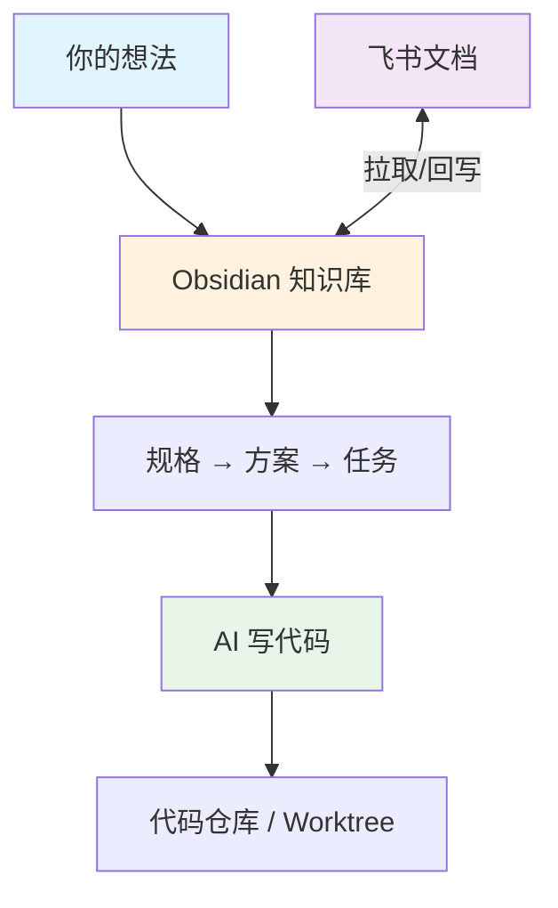

# 核心概念

不需要一次看完，用到的时候再回来翻。

---

## 一、知识库 = AI 的长期记忆

AI 的对话窗口就像人的短期记忆——聊多了，前面的就忘了。

解决办法：把重要信息写成文件，存在本地。AI 随时可以翻看，不怕忘。

这就是 Obsidian 知识库的作用：
- **你的需求**写在 `需求/` 文件夹里
- **AI 的工作规则**写在 `ai/` 文件夹里
- **沟通产出**（方案、调研）也保存在对应位置

你在 Obsidian 里能看到这些文件，AI 也能读写它们。**你和 AI 共享同一份资料。**

---

## 二、先说清楚再动手（规格驱动）

这是整套工作流最核心的理念。

想象你要装修房子：
1. **先画图纸**（规格）— 几个房间、每个房间多大、什么风格
2. **再出施工方案**（技术方案）— 用什么材料、走线怎么走、工期多久
3. **最后列施工清单**（任务清单）— 第一天拆墙、第二天水电、第三天…

每一步你看过觉得没问题了，再进入下一步。不会出现"你要的是中式，结果装成了欧式"的情况。

对应到 AI 开发：

```
你描述想法 → AI 写「规格」（你确认）
                ↓
           AI 写「技术方案」（你确认）
                ↓
           AI 写「任务清单」然后逐项执行
```

三个文件就在你的需求文件夹里，随时可以打开看。

---

## 三、拆小块做（小原子渐进）

AI 一次能处理的范围有限。需求越大越复杂，AI 越容易跑偏。

解决方法：把一个大需求拆成几个小块。每一块独立走「规格→方案→任务」的流程。

比如"做一个飞书机器人"可以拆成：
1. 消息接收（先让机器人能收到群里的消息）
2. 消息处理（理解消息内容，决定怎么回复）
3. 消息发送（把回复发到群里）

先把第 1 块做好、测试通过，再做第 2 块。这样每一步都是可控的。

---

## 四、Worktree = 平行世界

如果你同时在做两个需求，代码可能会互相打架。

Worktree 就是给每个需求开一个"平行世界"——代码互不干扰，做完再合并回来。

你不需要手动操作。用 `/start` 创建需求时，AI 会问你要不要关联代码仓库，选了就会自动创建。

---

## 五、飞书接入 = 线上资料也能用

你的 PRD 在飞书文档里？会议纪要在飞书录音里？

AI 可以直接拉取飞书文档的内容，保存到本地知识库。也可以把本地写好的方案推送回飞书文档。

不需要手动复制粘贴，告诉 AI 链接就行。

---

## 关系图


